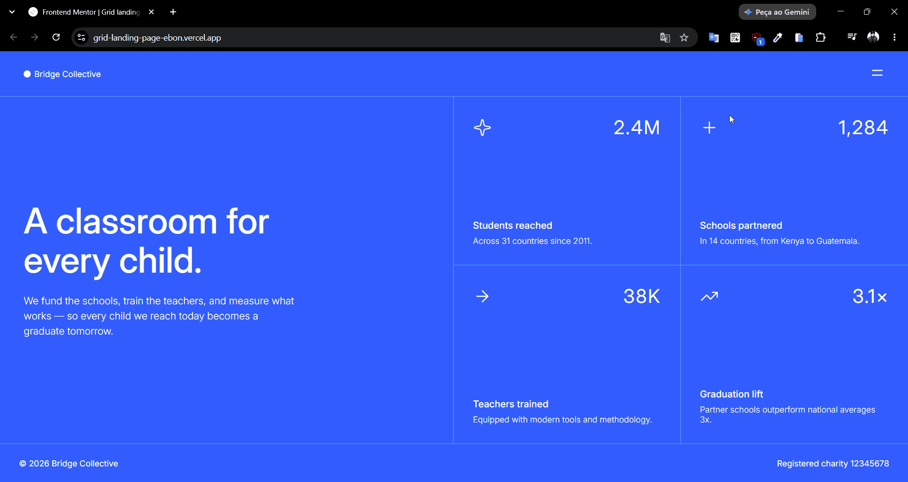

# Frontend Mentor - Grid landing page solution

This is a solution to the [Grid landing page challenge on Frontend Mentor](https://www.frontendmentor.io/challenges/grid-landing-page). Frontend Mentor challenges help you improve your coding skills by building realistic projects. 

## Table of contents

- [Overview](#overview)
  - [The challenge](#the-challenge)
  - [Screenshot](#screenshot)
  - [Links](#links)
- [My process](#my-process)
  - [Built with](#built-with)
  - [What I learned](#what-i-learned)
  - [Continued development](#continued-development)
  - [AI Collaboration](#ai-collaboration)
- [Author](#author)

## Overview

### The challenge

Users should be able to:

- View the optimal layout for the page depending on their device's screen size
- See hover and focus states for all interactive elements on the page
- Open and close the navigation menu at any screen size (optional JavaScript)

### Screenshot



### Links

- Solution URL: [Repo](https://github.com/otaviozerotwo/Grid-landing-page)
- Live Site URL: [Deploy](https://grid-landing-page-ebon.vercel.app/)

## My process

### Built with

- Semantic HTML5 markup
- CSS custom properties
- Flexbox
- CSS Grid
- Mobile-first workflow

### What I learned

Using componentization and nesting with pure CSS:

```css
@import 'base/reset.css';
@import 'base/variables.css';
@import 'layout/header.css';
@import 'layout/hero.css';
@import 'layout/stats.css';
@import 'layout/footer.css';

body {
/* another properties ... */

  &::before {
    / * another properties ... */
  }
}
```

Using the `has` pseudo-class to select the parent element of an element that does not have the `hidden = true` attribute.

```css
&:has(.header-menu:not([hidden])) {
  overflow: hidden;
}
```

Create an overlay directly on the body using the `before` pseudo-element:

```css
body {
  /* another properties ... */

  &::before {
    content: '';
    position: fixed;
    inset: 0;
    background-color: var(--color-black);
    opacity: 0.25;
    z-index: 2;
  }
}
```

Controlling layers using the `z-index` property:

```css
body {
  /* another properties ... */

  &::before {
    /* another properties ... */
    z-index: 2;
  }
}

.container {
  z-index: 1;
}
```

Implement a grid layout:

```css
.container {
  display: grid;
  grid-template-columns: 1fr 1fr;
  grid-template-rows: 1fr;
  flex-grow: 1;
}
```

Use the `nth-child` pseudo-class to retrieve only the odd-numbered children:

```css
.stats-item:nth-child(odd) {
  border-right: 2px solid var(--color-blue-400);
}
```

Create a click event listener:

```js
menuButton.addEventListener('click', () => {
  toggleMenu(headerMenu, menuButtonIcon, menuButton);
});
```

Using variables to control states depending on boolean values:

```js
const toggleMenu = (menu, icon, button) => {
  const isMenuOpen = menu.hidden;
  menu.hidden = !isMenuOpen;
  
  const iconPath = isMenuOpen ? iconClose : iconMenu;
  const ariaLabel = isMenuOpen ? 'Close menu' : 'Open menu';

  icon.src = iconPath;
  button.setAttribute('aria-label', ariaLabel);
  button.setAttribute('aria-expanded', String(isMenuOpen));
}
```

### Continued development

For future projects, I intend to practice even more DOM manipulation with JavaScript and the use of modern CSS.

### AI Collaboration

I used the codex integrated into VS Code for brainstorming.

## Author

- GitHub - [@otaviozerotwo](https://github.com/otaviozerotwo)
- Frontend Mentor - [@yourusername](https://www.frontendmentor.io/profile/otaviozerotwo)